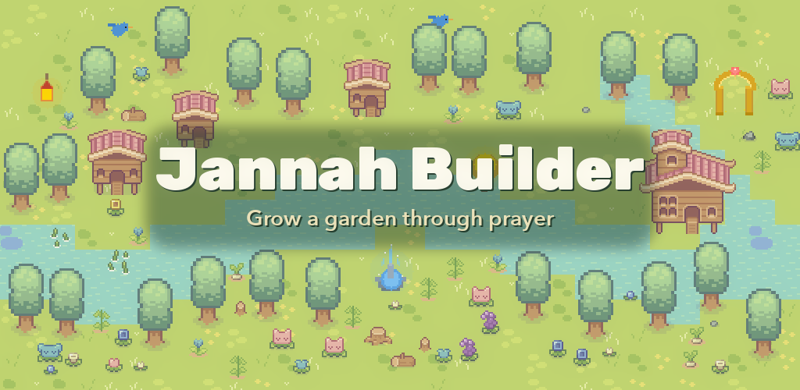

# Jannah Builder



A spiritually-sensitive prayer tracking app that visualises your spiritual journey as a growing pixel-art landscape.

[](https://github.com/faesel/jannah-builder/releases)

For more information, visit [binarymeadow.com/apps/jannah-builder](https://www.binarymeadow.com/apps/jannah-builder/).

## 🌳 About

Jannah Builder is a cross-platform mobile app built with React Native and Expo. It allows users to log their five daily prayers and watch their spiritual progress manifest as a beautiful, growing world inspired by Jannah (Paradise).

The app emphasises:
- **Calm reflection** over gamification
- **Gentle encouragement** over guilt or pressure
- **Gradual growth** earned through consistent practice
- **Beautiful impermanence** that mirrors spiritual reality

## 🛠 Technical Stack

- **React Native** & **Expo** (SDK 54) — Cross-platform framework
- **TypeScript** — Type-safe development
- **Expo Router** — File-based tab navigation
- **React Native Animated** — Smooth native-driven animations
- **AsyncStorage** — Local-first data persistence
- **expo-haptics** — Subtle tactile feedback
- **expo-av** — Completion sound effects
- **Node Canvas** — Pixel-art sprite generation scripts

## 🎮 Features

### Prayer Logging
- Log five daily prayers (Fajr, Dhuhr, Asr, Maghrib, Isha)
- Haptic feedback on each toggle
- Gentle chime when all five prayers are logged
- Three consecutive full days → one tree grows
- Trees progress: Sapling → Young → Mature

### Jannah Map
- Top-down pixel-art world rendered as a tile grid (scales to screen size)
- 6 grass tile variants with deterministic placement for natural-looking terrain
- Trees, flowers, buildings, and animals appear as you progress
- **Multi-stage flowers** — flowers spawn in several varieties and grow through stages over time, much like trees
- **Animated animals** — birds, rabbits, deer, and squirrels roam the map with feeding, idle, and movement behaviours; each species moves at a different speed with collision avoidance
- Visual effects for Qur'an reading (glowing flowers, warm golden overlay) and Dhikr (floating light particles)
- Illustrious items (radiant fountains, glowing trees, floating lanterns, light arches) appear during long streaks and fade gently when broken

### Obstacles (Taming the Map)
- A new map starts with 30 obstacles — stumps and rocks scattered across the untamed land
- **Rocks** are cleared one at a time for every prayer you log that day
- **Stumps** are cleared when you log Qur'an (one) and dhikr (one)
- Over time, consistent worship clears every obstacle from the map
- Obstacles never block placement of trees, flowers, or buildings; a missed prayer day gently returns one

### Gentle Decay
- Only triggered when an entire day is missed
- Affects one tree at a time (gradual degradation, never cascades)
- Buildings and animals also gently disappear when trees drop below their thresholds
- Newest elements are removed first, preserving older progress

### Supportive Practices
- **Qur'an logging** — simple "I read Qur'an today" toggle
- **Dhikr logging** — simple "I did dhikr today" toggle
- These enhance visual ambience but never generate or destroy trees
- **Barakah flowers** — logging Qur'an or dhikr has a small (2%) chance to spawn a permanent basic flower or bush on the map, a gentle, lasting reward for spiritual practice

### Rivers
- Rivers snake across the map as your garden grows (threshold: 35 trees)
- Water tiles follow a snake constraint — no two edges may touch
- Rivers cannot overlap trees or buildings
- Ground animals cannot cross water (birds can fly over but not land)
- Sand borders automatically surround every body of water

### Statistics
- Current streak and longest streak
- 7-day prayer history with completion indicators
- **Qur'an and Dhikr weekly trends** — visual dot indicators showing consistency
- Current world state vs all-time totals (toggle view)
- Garden age display

### Settings
- Accessible from Statistics page (not in bottom navigation)
- **About section** — describes the app as a motivational tool for Muslims
- **Reset Garden** — gentle two-step confirmation to clear all data
- **Version number** — displayed from app config

### Animated Wildlife
- **Birds, rabbits, deer, and squirrels** roam the map independently
- Three behaviours: idle (standing still), feeding (grazing animation), and moving (directional sprites)
- Per-species movement speed (birds fastest, deer slowest)
- Collision avoidance — animals cannot walk through buildings or trees (birds can perch on trees)
- Randomised timing so animals behave naturally

## 📁 Project Structure

```
jannah-builder/
├── app/              # Expo Router screens
│   ├── (tabs)/       # Tab navigation (Prayer, Jannah, Stats)
│   └── settings.tsx  # Settings page (accessed from Stats)
├── src/
│   ├── config/       # Game configuration & colour palette
│   ├── logic/        # Pure game mechanics (testable, deterministic)
│   ├── persistence/  # AsyncStorage profile management
│   ├── rendering/    # JannahCanvas and sprite definitions
│   ├── hooks/        # useGameLoop hook
│   ├── components/   # Reusable UI components (StatCard, ErrorBoundary)
│   ├── types/        # TypeScript interfaces
│   └── __tests__/    # Unit and integration tests
├── assets/
│   └── sprites/      # Pixel-art sprite images
│       ├── tiles/    # Grass (6 variants), dirt, path, water
│       ├── trees/    # Sapling, young, mature
│       ├── flowers/  # Basic and enhanced (Qur'an) variants
│       ├── buildings/# Home, mansion, palace
│       ├── animals/  # Bird, rabbit, deer, squirrel (+ animation frames)
│       └── illustrious/ # Fountain, glowing tree, lantern, light arch
├── scripts/          # Sprite generation scripts (Node Canvas)
├── docs/             # Implementation plan & store listing
└── .github/          # CI/CD workflows
```

## ⚙️ Configuration

All game mechanics are configuration-driven via `src/config/game.config.ts`:

- **Prayer thresholds** — consecutive days per tree, daily prayer names
- **Tree mechanics** — decay rules, growth stages
- **Building & animal thresholds** — when homes, mansions, palaces, and animals appear
- **Animal behaviour** — movement speed per species, idle/feeding/movement durations
- **Illustrious items** — streak thresholds for radiant fountains, glowing trees, lanterns, arches
- **Map** — grid size, tile size, expansion rules
- **Debug tools** — grid lines, show all sprites, simulated progress (days/months/years)

No game rules are hard-coded. Change the config to change the game.

## 🚀 Getting Started

### Prerequisites
- Node.js 20+
- npm
- Expo Go app (for mobile testing)

### Installation

```bash
npm install
npm start
```

### Platform-specific

```bash
npm run ios
npm run android
npm run web
```

### Development

```bash
npm run lint          # ESLint
npm run type-check    # TypeScript compiler check
npm test              # Jest test suite
```

## 📦 Releases

### Creating a Release

Releases are built and published via GitHub Actions. The workflow builds a release-signed AAB (for Google Play) and APK (for sideloading) on [EAS Build](https://docs.expo.dev/build/introduction/), runs all checks, and creates a GitHub Release.

#### 1. Bump the version

Update the `version` field in `app.json`:

```json
{
  "expo": {
    "version": "2.2.0"
  }
}
```

- **`version`** — semver string displayed to users
  - **Patch** (2.1.2 → 2.1.3) — bug fixes, minor tweaks
  - **Minor** (2.1.3 → 2.2.0) — new features, visual changes
  - **Major** (2.2.0 → 3.0.0) — breaking changes, major redesigns

> **`versionCode`** (the integer Google Play requires to increment on every upload) is managed automatically by EAS via `cli.appVersionSource: "remote"` in `eas.json` — you don't need to bump it by hand.

Commit and push the version bump to `main`.

#### 2. Set up signing (first time only)

Signing is handled by **EAS**, which generates and securely stores the release keystore for you.

1. **Create an Expo access token** at [expo.dev/settings/access-tokens](https://expo.dev/settings/access-tokens) and add it as a repository secret named **`EXPO_TOKEN`** in **Settings → Secrets and variables → Actions**.

2. **Generate the release keystore once** so non-interactive CI builds have credentials to use:

   ```bash
   npm i -g eas-cli   # or: pnpm add -g eas-cli
   eas login
   eas build --platform android --profile production
   ```

   Accept **"Generate a new Android Keystore"** when prompted. EAS stores it securely and reuses it for every build.

> **Important:** Keep Google **Play App Signing** enabled (the default). The EAS keystore acts as your *upload key*; Google re-signs with the app signing key. This is why builds must be release-signed — a debug-signed AAB is rejected by the Play Console.

#### 3. Tag the release

Create and push a `v`-prefixed tag matching the `app.json` version:

```bash
git tag v2.2.0
git push origin v2.2.0
```

Pushing the tag triggers the **Release** workflow, which will:
- Validate the tag format and check it matches the `app.json` version
- Run lint, type checks, and all tests
- Build a release-signed AAB (Play Store) and APK (sideloading) on EAS
- Create a GitHub Release for the tag with both files attached

#### 4. Publish to Google Play

1. Download the `.aab` file from the GitHub Release
2. Go to [Google Play Console](https://play.google.com/console)
3. Select your app → **Production** → **Create new release**
4. Upload the `.aab` file
5. Add release notes and submit for review

### Building Locally

> **Note:** Local Gradle builds are **debug-signed** and are only suitable for testing on your own device — the Play Console rejects them. For a release-signed AAB, use the EAS workflow above (or run `eas build --platform android --profile production` locally).

If you need a debug build on your machine:

#### Prerequisites

- **JDK 17** — download from [Adoptium](https://adoptium.net/)
- **Android SDK** — install via Android Studio or standalone SDK tools
- **Node.js** — version 18+

#### Steps

```bash
# 1. Clean prebuild to generate the android/ directory
npx expo prebuild --platform android --clean

# 2. Export the JS bundle and assets
npx expo export --platform android

# 3. Copy the exported bundle into the Android project
cp -r dist/* android/app/src/main/assets/

# 4. Build the AAB (debug-signed — local testing only, not for Play Store)
cd android
JAVA_HOME=~/jdk17/jdk-17.0.19+10/Contents/Home \
ANDROID_HOME=~/Library/Android/sdk \
./gradlew app:bundleRelease

# 5. Or build an APK (debug-signed — for sideloading onto your own device)
./gradlew app:assembleRelease
```

- AAB: `android/app/build/outputs/bundle/release/app-release.aab`
- APK: `android/app/build/outputs/apk/release/app-release.apk`

> **Note:** Adjust `JAVA_HOME` to match your JDK 17 path. JDK 24+ is not supported by the current Gradle version.

## 🎨 Design Philosophy

This app is built with deep respect for spiritual practice. It:
- Never shames users
- Never punishes harshly
- Never destroys large amounts of progress
- Never encourages obsessive behaviour
- Never compares users against each other

Growth is earned slowly. Loss is gentle and limited. Beauty can be temporary.

## ♿ Accessibility

- All interactive elements have `accessibilityLabel` and `accessibilityRole`
- Prayer toggles use `switch` role with checked state
- Touch targets meet the 44×44pt minimum
- Screen reader hints on non-obvious actions
- Calm colour palette with sufficient contrast

## 📜 Licence

Private project.

## 🤲 Note

This app is designed to support, not replace, genuine spiritual practice. May it be a means of drawing closer to Allah (SWT) ... ameen.
